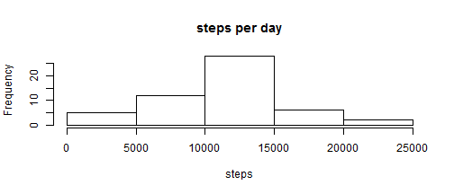
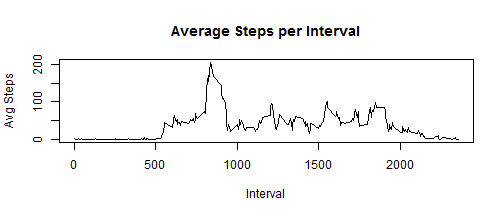

First, read in activity data.  This part assumes we have set the working directory 
to where there is a subdirectory "data" that contains the file
activity.csv


```r
DT <- read.csv("./data/activity.csv", header= TRUE)
```

create new dataframe summing steps by day. this is what will be plotted

```r
summry_day <- aggregate(steps ~ date, data=DT, FUN=sum, na.rmn=TRUE )
```


Make histogram of total number of steps taken by day


```r
hist(summry_day$steps,main="steps per day", xlab="steps")
```

 


Calculate and report the mean and median total number of steps taken per day.


```r
mean_steps <-format(round(mean(summry_day$steps),1), big.mark=',' ,nsmall=1)
med_steps <-format(round(median(summry_day$steps),1), big.mark=',' ,nsmall=1)
```

The mean number of steps per day is 10,767.2. 

The median number of steps per day is 10,766.0.


 create new dataframe averaging steps per 5 min interval, averaged across all days

this is what will be plotted


```r
avg_steps <- aggregate(steps ~ interval, data=DT, FUN=mean, na.rmn=TRUE )
```

### Time series plot of average daliy activity pattern


```r
with (avg_steps, plot( interval , steps, type="l",  main="Average Steps per Interval" 
                 ,xlab="Interval",
                 ylab="Avg Steps")
)
```

 

#### Compute 5 minute interval with  the maximum number of steps

```r
dat_sorted <- avg_steps[order(-avg_steps$steps ) , ]
top_interval <-dat_sorted[1, "interval"]
```
The Interval with the most number of steps is 835.

### Imputing missing values

1) Count missing values

```r
Numb_missing=format(sum(!complete.cases(DT)), big.mark=',')
```
The number of observations with missing values is 2,304.

2) Strategy for replacing missing values.  
I will replace missing values based on the average for that day of the week. 
I will first append the day of the week, then calculate the average for each
weekday.
We will need the lubridate package for this.

```r
library(lubridate)
DT$wkday <-wday(DT$date)

wkdy_avg <- aggregate(steps ~ wkday, data=DT, FUN=mean, na.rmn=TRUE )
colnames(wkdy_avg)[2] <-"avg_steps"
#merge by wkday
```
3.Create a new dataset that is equal to the original dataset 
but with the missing data filled in.
Merge original dataset with newly created averages by weekday.
Next, substitute this weekday average for the rows that have missing data.

```r
COMB_DF <- merge(DT, wkdy_avg, by="wkday", sort=FALSE)
# if steps is missing, replace it with avg_steps
COMB_DF$recoded_steps <- ifelse(
        is.na(COMB_DF$steps) ,  COMB_DF$avg_steps , COMB_DF$steps
        )
# keep only variables we need and rename recoded_steps to steps
new_data<-COMB_DF[, c(1,3,4,6)]
names(new_data)[4]="steps"
```

4.Make a histogram of the total number of steps taken each day 
and Calculate and report the mean and median total number of steps
taken per day. 


create new dataframe summing steps by day. this is what will be plotted

```r
summry_day2 <- aggregate(steps ~ date, data=new_data, FUN=sum )
```


Make histogram of total number of steps taken by day


```r
hist(summry_day2$steps,main="steps per day", xlab="steps")
```

 


Calculate and report the mean and median total number of steps taken per day.


```r
mean_steps2 <-format(round(mean(summry_day2$steps),1), big.mark=',' ,nsmall=1)
med_steps2 <-format(round(median(summry_day2$steps),1), big.mark=',' ,nsmall=1)
```

The mean number of steps per day (after mean imputation) is 10,821.2. 

The median number of steps per day (after mean imputation) is 11,015.0.

The mean steps per day removing missing values is 10,767.2, 
compared to 10,821.2 after replacing missing values.

The median steps per day removing missing values is 10,766.0,
compared to 11,015.0 after replacing missing values.

#### Since the mean and median are both higher after replacing missing values,
#### the weekdays with missing values had more steps overall.

### Are there differences in activity patterns between weekdays and weekends?
1.Create a new factor variable in the dataset with two levels -
"weekday" and "weekend" indicating whether a given date is a
weekday or weekend day.


```r
new_data$wkend <- as.factor(ifelse(new_data$wkday==1 | new_data$wkday==7 ,
                   "weekend", "weekday")
                                )
```

2. Make a panel plot containing a time series plot (i.e. type = "l") of the 
5-minute interval (x-axis) and the average number of steps taken, 
averaged across all weekday days or weekend days (y-axis). 

```r
# compute avg steps per 5 minute interval and weekend indicator
wkdy_avg <- aggregate(steps ~ wkend + interval, data=new_data, FUN=mean
               )
```


```r
library(ggplot2)
ggplot(wkdy_avg, aes(x=interval, y=steps )) +
        ggtitle("Averege Steps by interval")+
        labs(x="Interval", y="Steps") +
        geom_line() +
        facet_wrap(~wkend, ncol=1)
```

 
